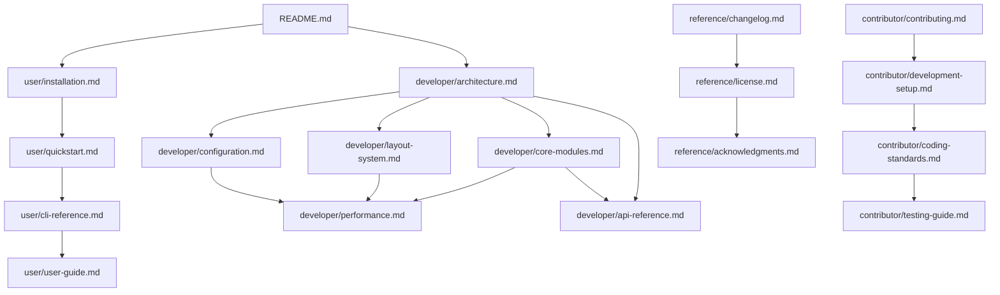

# 📖 文档导航中心

Win-Manager 教学文档体系的完整导航指南，帮助您快速找到所需信息并建立系统性的学习路径。

## 🎯 学习路径

### 🚀 新手入门路径 (15分钟快速上手)
```
📍 开始 → 🔧 安装 → ⚡ 快速开始 → 📋 CLI参考 → 💪 进阶使用
```

1. **[项目概览](../README.md)** - 了解 Win-Manager 是什么
2. **[安装指南](user/installation.md)** - 环境要求和安装步骤
3. **[快速开始](user/quickstart.md)** - 5分钟上手教程
4. **[CLI参考](user/cli-reference.md)** - 常用命令速查
5. **[用户指南](user/user-guide.md)** - 详细使用说明

### 🔧 开发者学习路径 (深入技术实现)
```
📍 架构 → 🧩 核心模块 → 📐 布局系统 → ⚙️ 配置 → ⚡ 性能 → 📚 API
```

1. **[架构设计](developer/architecture.md)** - 系统整体架构
2. **[核心模块](developer/core-modules.md)** - 核心组件详解
3. **[布局系统](developer/layout-system.md)** - 布局算法和扩展
4. **[配置系统](developer/configuration.md)** - 配置管理详解
5. **[性能分析](developer/performance.md)** - 性能优化策略
6. **[API参考](developer/api-reference.md)** - 完整API文档

### 🤝 贡献者学习路径 (参与项目开发)
```
📍 环境 → 📏 规范 → 🧪 测试 → 🔧 工具 → 🤝 贡献 → 🔒 安全
```

1. **[开发环境](contributor/development-setup.md)** - 开发环境配置
2. **[代码规范](contributor/coding-standards.md)** - 编码标准和最佳实践
3. **[测试指南](contributor/testing-guide.md)** - 测试编写和运行
4. **[构建发布](contributor/build-release.md)** - 构建和发布流程
5. **[贡献指南](contributor/contributing.md)** - 如何参与贡献
6. **[安全政策](contributor/security.md)** - 安全问题处理

## 📂 文档分类索引

### 👥 用户文档 (`docs/user/`)
**适用对象**: 软件使用者，包括个人用户和系统管理员

| 文档 | 描述 | 预估阅读时间 | 前置要求 |
|------|------|------------|----------|
| [安装指南](user/installation.md) | 系统要求、安装步骤、故障排除 | 10分钟 | 基础Windows知识 |
| [快速开始](user/quickstart.md) | 5分钟快速上手教程 | 5分钟 | 已完成安装 |
| [CLI参考](user/cli-reference.md) | 完整的命令行界面参考 | 20分钟 | 基础CLI使用经验 |
| [用户指南](user/user-guide.md) | 详细的功能使用说明 | 30分钟 | 完成快速开始 |
| [故障排除](user/troubleshooting.md) | 常见问题解决方案 | 按需查阅 | 遇到具体问题时 |
| [使用示例](user/examples/) | 实际使用场景和脚本 | 15分钟 | 基础使用经验 |

### 🔧 开发者文档 (`docs/developer/`)
**适用对象**: 想要理解内部实现或扩展功能的开发者

| 文档 | 描述 | 技术难度 | 相关知识 |
|------|------|---------|---------|
| [架构设计](developer/architecture.md) | 系统整体架构和设计模式 | ⭐⭐⭐ | 软件架构、设计模式 |
| [核心模块](developer/core-modules.md) | 核心组件的详细实现 | ⭐⭐⭐⭐ | Python编程、Windows API |
| [布局系统](developer/layout-system.md) | 布局算法设计和扩展 | ⭐⭐⭐⭐ | 算法设计、数学计算 |
| [配置系统](developer/configuration.md) | 配置管理的完整实现 | ⭐⭐⭐ | 配置管理模式 |
| [性能分析](developer/performance.md) | 性能监控和优化策略 | ⭐⭐⭐⭐⭐ | 性能调优、监控 |
| [API参考](developer/api-reference.md) | 完整的API文档 | ⭐⭐ | Python编程基础 |

### 🤝 贡献者文档 (`docs/contributor/`)
**适用对象**: 想要参与项目开发的贡献者

| 文档 | 描述 | 重要程度 | 适用场景 |
|------|------|---------|---------|
| [开发环境](contributor/development-setup.md) | 开发环境配置指南 | ⭐⭐⭐⭐⭐ | 首次参与开发 |
| [代码规范](contributor/coding-standards.md) | 编码标准和最佳实践 | ⭐⭐⭐⭐⭐ | 代码提交前必读 |
| [测试指南](contributor/testing-guide.md) | 测试编写和运行指南 | ⭐⭐⭐⭐ | 编写测试用例 |
| [构建发布](contributor/build-release.md) | 构建和发布流程 | ⭐⭐⭐ | 维护者和发布管理 |
| [贡献指南](contributor/contributing.md) | 如何参与项目贡献 | ⭐⭐⭐⭐⭐ | 所有贡献者必读 |
| [安全政策](contributor/security.md) | 安全问题报告和处理 | ⭐⭐⭐ | 发现安全问题时 |

### 📚 参考文档 (`docs/reference/`)
**适用对象**: 需要查阅具体信息的所有用户

| 文档 | 描述 | 更新频率 | 用途 |
|------|------|---------|------|
| [更新日志](reference/changelog.md) | 完整的版本历史记录 | 每次发布 | 了解版本变化 |
| [许可证](reference/license.md) | 法律信息和使用条款 | 很少更新 | 法律合规性 |
| [致谢名单](reference/acknowledgments.md) | 贡献者和感谢信息 | 定期更新 | 了解项目历史 |

## 🔗 文档关联关系图

### 核心关联关系


### 跨领域关联
- **安装** ↔ **开发环境**: 用户安装和开发环境配置
- **CLI参考** ↔ **API参考**: 命令行接口和编程接口
- **架构设计** ↔ **性能分析**: 设计决策的性能影响
- **布局系统** ↔ **用户指南**: 布局功能的使用说明

## 🎓 按角色推荐阅读

### 👤 最终用户
**目标**: 高效使用 Win-Manager 管理窗口

**推荐阅读顺序**:
1. [项目概览](../README.md) → [安装指南](user/installation.md)
2. [快速开始](user/quickstart.md) → [CLI参考](user/cli-reference.md)
3. [用户指南](user/user-guide.md) → [使用示例](user/examples/)
4. 遇到问题时: [故障排除](user/troubleshooting.md)

### 🔧 系统管理员
**目标**: 在企业环境中部署和管理

**推荐阅读顺序**:
1. [安装指南](user/installation.md) → [配置系统](developer/configuration.md)
2. [CLI参考](user/cli-reference.md) → [用户指南](user/user-guide.md)
3. [故障排除](user/troubleshooting.md) → [性能分析](developer/performance.md)

### 💻 应用开发者
**目标**: 集成 Win-Manager 到自己的应用中

**推荐阅读顺序**:
1. [架构设计](developer/architecture.md) → [API参考](developer/api-reference.md)
2. [核心模块](developer/core-modules.md) → [配置系统](developer/configuration.md)
3. [使用示例](user/examples/) → [性能分析](developer/performance.md)

### 🧩 功能扩展开发者
**目标**: 为 Win-Manager 开发新功能

**推荐阅读顺序**:
1. [架构设计](developer/architecture.md) → [核心模块](developer/core-modules.md)
2. [布局系统](developer/layout-system.md) → [API参考](developer/api-reference.md)
3. [开发环境](contributor/development-setup.md) → [代码规范](contributor/coding-standards.md)
4. [测试指南](contributor/testing-guide.md) → [贡献指南](contributor/contributing.md)

### 🔍 研究者/学习者
**目标**: 深入理解窗口管理技术

**推荐阅读顺序**:
1. [架构设计](developer/architecture.md) → [核心模块](developer/core-modules.md)
2. [布局系统](developer/layout-system.md) → [性能分析](developer/performance.md)
3. [配置系统](developer/configuration.md) → [API参考](developer/api-reference.md)
4. [更新日志](reference/changelog.md) - 了解演进历史

## 📖 主题索引

### 🏗️ 架构和设计
- [架构设计](developer/architecture.md) - 整体架构
- [核心模块](developer/core-modules.md) - 组件设计
- [布局系统](developer/layout-system.md) - 算法设计
- [配置系统](developer/configuration.md) - 配置架构

### ⚡ 性能和优化
- [性能分析](developer/performance.md) - 性能监控和优化
- [开发环境](contributor/development-setup.md) - 开发工具配置
- [测试指南](contributor/testing-guide.md) - 性能测试

### 🔧 使用和配置
- [快速开始](user/quickstart.md) - 基础使用
- [CLI参考](user/cli-reference.md) - 命令参考
- [用户指南](user/user-guide.md) - 详细说明
- [配置系统](developer/configuration.md) - 配置详解

### 🛠️ 开发和贡献
- [开发环境](contributor/development-setup.md) - 环境搭建
- [代码规范](contributor/coding-standards.md) - 编码标准
- [贡献指南](contributor/contributing.md) - 参与贡献
- [API参考](developer/api-reference.md) - 编程接口

### 🐛 故障排除
- [故障排除](user/troubleshooting.md) - 常见问题
- [安全政策](contributor/security.md) - 安全问题
- [更新日志](reference/changelog.md) - 已知问题

## 🔍 快速查找

### 按关键词查找
- **安装**: [安装指南](user/installation.md)
- **配置**: [配置系统](developer/configuration.md), [用户指南](user/user-guide.md)
- **布局**: [布局系统](developer/layout-system.md), [CLI参考](user/cli-reference.md)
- **性能**: [性能分析](developer/performance.md)
- **API**: [API参考](developer/api-reference.md)
- **测试**: [测试指南](contributor/testing-guide.md)
- **贡献**: [贡献指南](contributor/contributing.md)

### 按任务查找
- **我想快速上手**: [快速开始](user/quickstart.md)
- **我遇到了问题**: [故障排除](user/troubleshooting.md)
- **我想了解原理**: [架构设计](developer/architecture.md)
- **我想参与开发**: [贡献指南](contributor/contributing.md)
- **我想扩展功能**: [布局系统](developer/layout-system.md)
- **我想优化性能**: [性能分析](developer/performance.md)

## 📱 移动友好的文档导航

### 精简版学习路径
```
🚀 快速开始:
README → 安装 → 快速开始 → CLI参考

🔧 深入学习:
架构 → 核心模块 → API参考

🤝 参与贡献:
贡献指南 → 开发环境 → 代码规范
```

## 📊 文档统计信息

### 文档覆盖度
- **用户文档**: 6个主要文档，覆盖从安装到高级使用
- **开发者文档**: 6个技术文档，覆盖架构到API
- **贡献者文档**: 6个流程文档，覆盖环境到发布
- **参考文档**: 3个参考资料，覆盖历史到法律

### 总体规模
- **文档总数**: 21+ 个主要文档
- **预估总字数**: 15万+ 字
- **代码示例**: 200+ 个
- **关联链接**: 100+ 个

## 🔄 文档更新和维护

### 更新频率
- **用户文档**: 功能更新时同步更新
- **开发者文档**: 架构变更时更新
- **贡献者文档**: 流程改进时更新  
- **参考文档**: 版本发布时更新

### 质量保证
- 所有文档都经过多轮审查
- 代码示例都经过实际测试
- 定期检查链接有效性
- 持续收集用户反馈改进

---

**💡 使用建议**:
1. **书签此页面** - 作为文档导航的起点
2. **按需阅读** - 根据当前需求选择相应文档
3. **循序渐进** - 遵循推荐的学习路径
4. **实践结合** - 边读文档边动手实践
5. **反馈改进** - 发现问题及时反馈

**📞 获取帮助**:
- GitHub Issues: 报告文档问题
- GitHub Discussions: 提出文档建议
- 社区交流: 与其他用户讨论

**最后更新**: 2024-07-19